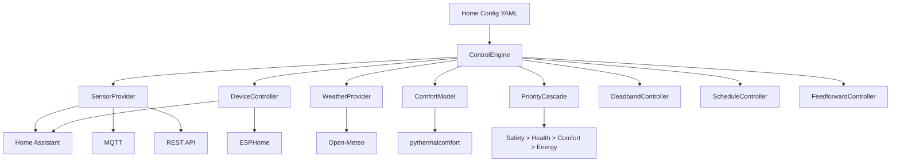

# ClimatIQ

**ASHRAE 55-based smart home climate intelligence framework**

[](https://github.com/ipanov/climatiq/actions/workflows/ci.yml)
[](https://opensource.org/licenses/MIT)
[](https://www.python.org/)
[](https://github.com/astral-sh/ruff)

ClimatIQ is a generic, extensible Python framework for intelligent home climate
control. It provides domain models, comfort algorithms, and control strategies
that work with **any home, any layout, any devices**.

Built on proven science (ASHRAE 55, ISO 7730, WHO air quality guidelines) and
reusing established open-source libraries (`pythermalcomfort`, `pydantic`).

## Features

- **PMV/PPD thermal comfort** via `pythermalcomfort` (ASHRAE 55 / ISO 7730)
- **Generic domain models** — Home, Zone, Sensor, Device as Pydantic models
- **Provider interfaces** — abstract base classes for sensors, devices, weather, AQI
- **Priority cascade** — Safety > Health > Comfort > Energy
- **Deadband control** — hysteresis to prevent short-cycling
- **Predictive scheduling** — solar geometry + weather forecast feedforward
- **Aggregate comfort score** — 0-100 combining PMV, humidity, dew point, AQ
- **Fully configurable** — YAML config for any home layout
- **Home Assistant integration** — reference HA configs included

## Quick Start

### Install

```bash
pip install -e ".[dev]"
```

### Configure

Create a `config/my-home.yaml` (see `config/example-home.yaml` for a full example):

```yaml
home:
  name: "My Home"
  latitude: 40.7128
  longitude: -74.0060
  timezone: "America/New_York"
  zones:
    - id: "living_room"
      name: "Living Room"
      window_bearing_deg: 180  # South-facing
      sensor_ids: ["lr_temp"]
      device_ids: ["lr_ac"]
```

### Use

```python
from climatiq.comfort.pmv import calculate_pmv
from climatiq.comfort.dew_point import calculate_dew_point
from climatiq.comfort.score import calculate_comfort_score

# Calculate PMV/PPD
result = calculate_pmv(air_temp=24.0, humidity=50.0, clothing=0.7)
print(f"PMV: {result.pmv:+.2f}, PPD: {result.ppd:.1f}%, Level: {result.comfort_level.value}")

# Calculate dew point
dp = calculate_dew_point(22.0, 55.0)
print(f"Dew point: {dp}°C")

# Aggregate comfort score
score = calculate_comfort_score(pmv_result=result, humidity=55.0, dew_point=dp)
print(f"Comfort score: {score}/100")
```

### CLI

```bash
# PMV calculator
climatiq-pmv --temp 24 --humidity 50 --clo 0.7

# Comfort score
climatiq-comfort --temp 24 --humidity 50
```

## Architecture



### Key Abstractions

| Interface | Purpose |
|-----------|---------|
| `SensorProvider` | Read sensor data (temp, humidity, CO2, PM2.5, etc.) |
| `DeviceController` | Control devices (HVAC, humidifier, purifier, switch) |
| `WeatherProvider` | Outdoor weather data |
| `AirQualityProvider` | Outdoor air quality data |
| `ComfortModel` | Calculate thermal comfort (PMV/PPD) |
| `ControlStrategy` | Decide what actions to take |

### Priority Cascade

Every control decision follows this hierarchy:

1. **Safety** — Frost protection, overheat, CO2 > 2000 ppm (immediate action)
2. **Health** — CO2, PM2.5, TVOC, HCHO (30-second response)
3. **Comfort** — PMV within +/-0.5, dew point < 15°C (5-minute response)
4. **Energy** — Minimize runtime, avoid peak hours (scheduled)

## Testing

```bash
# Run all tests
pytest

# With coverage
pytest --cov=climatiq --cov-report=term-missing

# Fast tests only (no slow markers)
pytest -m "not slow"
```

## Development

```bash
# Install dev dependencies
pip install -e ".[dev]"

# Set up pre-commit hooks
pre-commit install

# Lint
ruff check src/ tests/

# Type check
mypy src/
```

## Documentation

- [Architecture](docs/architecture.md) — System architecture with diagrams
- [Device Inventory](docs/device-inventory.md) — Reference deployment devices
- [Example Config](config/example-home.yaml) — Full home configuration example

## Reference Standards

| Standard | Used For |
|----------|----------|
| ASHRAE 55-2020 | Thermal comfort criteria, PMV/PPD ranges |
| ISO 7730:2005 | PMV calculation method, comfort categories |
| EN 16798-1:2019 | European indoor environment criteria |
| WHO AQG 2021 | PM2.5, CO2, TVOC, HCHO health-based limits |

## License

MIT — see [LICENSE](LICENSE).
